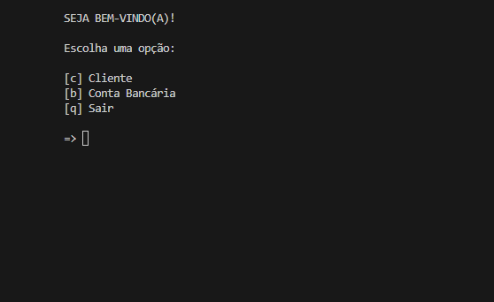
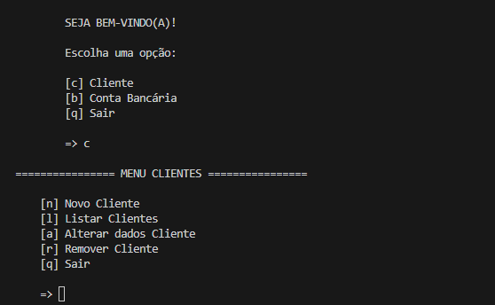
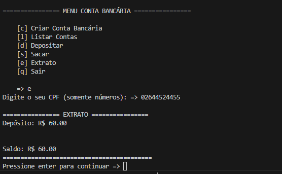
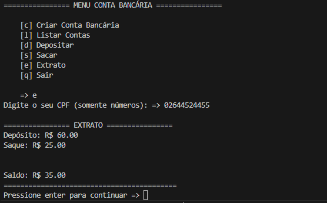

# 🏦 Desafio de Código — Sistema Bancário em Python / Code Challenge — Banking System in Python

[🇧🇷 Português](#-português) | [🇺🇸 English](#-english)

---

## 🇧🇷 Português

Este projeto consiste em um sistema bancário funcional desenvolvido inteiramente em **Python**. O objetivo principal é demonstrar a aplicação de conceitos avançados da linguagem, como a modularização de funções e o uso rigoroso de diferentes tipos de passagem de argumentos (positional-only e keyword-only).

### 🖼️ Demonstração Visual  


### 📂 Estrutura de Arquivos  
A organização do projeto segue boas práticas de separação de responsabilidades:

├── main.py  
├── clienteTela.py  
├── contaTela.py  
├── model/  
│ ├── client.py  
│ ├── conta.py  
|  
├── img/  
│ ├── menu.png  
│ ├── menu_clientes.png  
│ ├── deposito.png   
│ └── saque.png  
|  
├── LICENSE  
└── README

* **`main.py`**: Ponto de entrada do sistema e gerenciamento do menu principal.
* **`clienteTela.py` e `contaTela.py`**: Menus principais para o gerenciamento de Clientes e Contas Bancárias.
* **`model/`**: Contém a lógica de definição para **Clientes** e **Contas Bancárias**.
* **`img/`**: Pasta que armazena as capturas de tela da interface CLI.
* **`LICENSE`**: Termos de uso e distribuição do código.
* **`README.md`**: Documentação completa do projeto e guia de execução.

### 🛠️ Especificações Técnicas
* **Linguagem:** Python 3.10+
* **Bibliotecas:** Utiliza apenas a *Standard Library* (sem dependências externas), facilitando a execução em qualquer ambiente.
* **Paradigma:** Programação Estruturada com foco em funções puras e modularização.

### ✅ Funcionalidades Implementadas

#### 👤 Cadastro de Usuário (Cliente)
- Armazena nome, data de nascimento, CPF e endereço.
- Impede cadastro duplicado pelo CPF.
- **Menu de Gerenciamento:** Permite listar, alterar e remover clientes.



#### 🏛️ Cadastro de Conta Bancária
- Cada conta é vinculada a um cliente existente.
- Número da conta gerado automaticamente.

#### 💰 Operações Bancárias
- **Depósito**: Recebe argumentos **somente por posição**. Atualiza saldo e extrato.
- **Saque**: Recebe argumentos **somente nomeados** (*kwargs). Valida saldo insuficiente, limite por saque e limite diário.
- **Extrato**: Exibe todas as movimentações detalhadas por CPF.




### ✅ Regras de Passagem de Argumentos
| Função | Tipo de Argumentos | Assinatura |
|-------|---------------------|------------|
| **saque** | keyword-only | `def saque(*, saldo, valor, extrato, limite, numero_saques, limite_saques)` |
| **depósito** | positional-only | `def deposito(saldo, valor, extrato, /)` |
| **extrato** | mixed | `def exibir_extrato(saldo, /, *, extrato)` |

A escolha de argumentos positional-only no `depósito` garante que a sintaxe seja limpa e rápida, enquanto os `keyword-only` no saque evitam erros acidentais ao passar valores críticos.


### ✅ Outras Funcionalidades
- **Modelos (model)** para criação de **clientes** e **contas**.
- Listagem de clientes e contas existentes.
- Menu interativo para navegação entre operações.

### ⚙️ Como Executar
1. Certifique-se de ter o **Python 3.x** instalado em sua máquina.  

2. Clone o repositório:
   ```bash
   git clone [https://github.com/helensjferreira-dev/sistema-bancario-python.git](https://github.com/helensjferreira-dev/sistema-bancario-python.git) 

3. Navegue até a pasta do projeto:
   ```bash
   cd sistema-bancario-python

4. Execute o sistema:
   ```bash
   python main.py

### 🚀 Próximas Melhorias (Backlog)
- Seleção de conta para múltiplos registros.
- Busca de contas por CPF ou faixa de saldo.
- Persistência de dados em arquivo (JSON ou banco de dados).

---

## 🇺🇸 English

# 🏦 Code Challenge — Banking System in Python

This is a functional banking system developed using Python. The main goal is to demonstrate the application of advanced language concepts, such as modular functions and the rigorous use of different argument passing types (positional-only and keyword-only).

### 🖼️ Visual Demonstration


### 📂 File Structure
The project organization follows modularization best practices:

├── main.py  
├── clienteTela.py  
├── contaTela.py  
├── model/  
│ ├── client.py  
│ ├── conta.py  
|  
├── img/  
│ ├── menu.png  
│ ├── menu_clientes.png  
│ ├── deposito.png  
│ └── saque.png  
|  
├── LICENSE    
└── README

* **`main.py`**: System entry point and main menu management.
* **`clienteTela.py` and `contaTela.py`**: Main menus for Client and Bank Account management.
* **`model/`**: Contains definition logic for Clients and Bank Accounts.
* **`img/`**: Folder storing screenshots of the CLI interface.
* **`LICENSE`**: Terms of use.
* **`README.md`**: Complete project documentation and execution guide.


### 🛠️ Technical Specifications
* **Language:** Python 3.10+
* **Libraries:** Uses only the *Standard Library* (no external dependencies)
* **Paradigm:** Structured Programming with a focus on pure functions and modularization.

### ✅ Implemented Features

#### 👤 User Registration (Client)
- Stores name, date of birth, Tax ID (CPF), and address.
- Prevents duplicate registration using the Tax ID.
- **Management Menu:** Options to list, update, and remove clients.


#### 🏛️ Bank Account Registration
- Each account is linked to an existing client.
- Automatically generated account numbers.

#### 💰 Banking Operations
- **Deposit**: Receives arguments **positional-only**. Updates balance and statement history.
- **Withdrawal**: Receives arguments **keyword-only** (*kwargs). Validates insufficient balance, withdrawal limit, and daily limits.
- **Statement**: Displays all detailed transactions by Tax ID.


### ✅ Argument Passing Rules  

| Function | Argument Type | Signature |
|-------|---------------------|------------|
| **Withdrawal** | keyword-only | `def saque(*, saldo, valor, extrato, limite, numero_saques, limite_saques)` |
| **Deposit** | positional-only | `def deposito(saldo, valor, extrato, /)` |
| **Statement** | mixed | `def exibir_extrato(saldo, /, *, extrato)` |

The choice of positional-only arguments in the deposit function ensures a clean and fast syntax, while keyword-only arguments in the withdrawal function prevent accidental errors when passing critical values.

### ✅ Other Features
- **Models (model)** for creating **clients** and **accounts**.
- List of registered clients and existing accounts.
- Interactive menu for navigation between operations.

### ⚙️ How to Run
1. Ensure you have **Python 3.x** installed.  

2. Clone the repository:
   ```bash
   git clone [https://github.com/helensjferreira-dev/sistema-bancario-python.git](https://github.com/helensjferreira-dev/sistema-bancario-python.git) 

3. Navigate to the project folder:
   ```bash
   cd sistema-bancario-python

4. Run the system:
   ```bash
   python main.py


### 🚀 Future Improvements (Backlog)
- Account selection for multiple records.
- Search for accounts by Tax ID or balance range.
- Data persistence (JSON file or Database).

### 📄 License

This project is licensed under the MIT License. See the [LICENSE](./LICENSE) file for details.

---


## 👤 Autora / Author

**Hélen Ferreira** - Desenvolvedora / Developer  
📸 [Linkedin](https://www.linkedin.com/in/helensjferreira-dev/)
💬 [WhatsApp](https://wa.me/5548988183720)